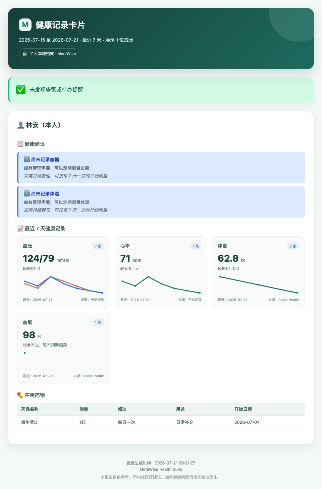

# MediWise Health Suite

<div align="center">

**面向 OpenClaw 的个人本地健康助手**

把散落在聊天、报告、饮食记录和可穿戴设备里的信息，整理成可持续查询、追踪和迁移的家庭健康档案。

[](https://github.com/JuneYaooo/mediwise-health-suite/releases/tag/v2.0.9)
[](LICENSE)
[](https://www.python.org/downloads/)
[](https://openclaw.ai)
[](https://github.com/JuneYaooo/mediwise-health-suite/stargazers)

[5 分钟上手](#-5-分钟上手) · [功能全览](#-功能全览) · [真实示例](#-真实使用示例) · [隐私与安全](#-隐私与安全) · [完整文档](#-文档导航)

</div>

---

## 为什么做这个项目

家庭健康管理最容易卡在两件事上：平时记录断档，需要就医时又临时找不到关键信息。

MediWise 把这条链路串起来：

```text
建立家庭档案 → 对话/图片录入 → 持续追踪 → 异常提醒 → 就医前整理 → 本地备份迁移
```

你可以用自然语言记录血压、血糖、用药、饮食、体重、睡眠和运动，也可以导入体检报告、Apple Health 或 Gadgetbridge 数据。默认数据保存在本地 SQLite，不依赖某个健康平台才能继续使用。

> MediWise 用于健康信息记录、整理和趋势参考，不提供诊断，也不能替代医生或营养师。

## 📷 真实使用示例

<table>
  <tr>
    <td width="33%" align="center"></td>
    <td width="33%" align="center"></td>
    <td width="33%" align="center"></td>
  </tr>
  <tr>
    <td align="center">① 对话安装 Skill</td>
    <td align="center">② 自动说明可用能力</td>
    <td align="center">③ 创建家庭成员档案</td>
  </tr>
</table>

以上均为在飞书中安装并使用 OpenClaw 时的 MediWise Health Suite 实际截图。不同 OpenClaw 客户端和版本的界面可能略有差异。

### 健康记录卡片示例

当你说“帮我生成最近 7 天的健康记录卡片”，MediWise 会根据本地档案生成一张可以直接在聊天中查看的图片。卡片会汇总指定时间范围内的最新指标、记录次数、期初变化、数据来源、提醒和在用药；趋势图使用内联 SVG，生成时不依赖外部图表服务。

<p align="center">
  
</p>

> 上图由项目内置的真实卡片生成链路制作，使用的是虚构成员和虚构健康数据，仅用于展示效果，不代表医疗建议。

只有一个“本人”档案时，可以直接说：

```text
帮我生成最近 7 天的健康记录卡片
```

如果已经建立了多位家庭成员，需要明确姓名；助手会在生成前确认“姓名（身份）”：

```text
帮我生成张建国最近 7 天的健康记录卡片
```

没有记录的项目会明确显示为暂无数据，卡片不会为了补全版面编造指标。默认范围为最近 7 天，也可以改成最近 30 天等时间范围。

## ✨ 功能全览

| 模块 | 能做什么 | 当前状态 |
|---|---|---|
| 🏥 健康档案 | 家庭成员、门诊/住院/急诊、症状、诊断、用药、检验和影像记录 | 已实现 |
| 📈 健康指标 | 血压、血糖、心率、体温等指标录入、查询和趋势分析 | 已实现 |
| 🖼 报告识别 | PaddleOCR 本地文字识别；可选视觉模型处理复杂版面、图表与结构化提取 | 已实现 |
| 💊 用药与提醒 | 在用药管理、服药记录、复查提醒、药物相互作用辅助查询 | 已实现 |
| 🍎 饮食追踪 | 餐次记录、食物来源查询、营养汇总和营养目标 | 已实现 |
| ⚖️ 体重与运动 | 体重趋势、BMI/BMR/TDEE、目标、围度与运动记录 | 已实现 |
| 😴 睡眠 | 睡眠时长、深睡/浅睡/REM/清醒分期、日报和周趋势 | 已实现 |
| ⌚ 可穿戴导入 | Apple Health、Gadgetbridge；检查格式后统一写入健康指标 | 已验证 |
| 🚨 健康监测 | 个性化阈值、异常检测、告警、仪表盘和趋势分析 | 持续完善 |
| 🧾 就医前整理 | 汇总近期病情、指标、用药和既往史，导出文本/图片/PDF | 已实现 |

### 可穿戴接入状态

“仓库里有 Provider 文件”不等于“用户现在就能用”。这里按实际完成度分级：

| 来源 | 当前结论 | 用户需要准备什么 |
|---|---|---|
| **Apple Watch / iPhone** | ✅ 已验证可用 | 在 iPhone 健康 App 导出的 `export.zip` 或 `export.xml` |
| **Gadgetbridge** | ✅ 已验证可用 | Gadgetbridge 导出的 SQLite 数据库；适用于其已兼容并配对的设备 |
| **Garmin Connect** | 🧪 实验性 | 使用非官方接口且需要一次安全账号认证；目前不作为普通用户默认接入方式 |
| **Huawei Health Kit** | ⛔ 暂不可用 | OAuth 授权回调尚未完成 |
| **Zepp / 小米账号云同步** | ⛔ 暂不可用 | 账号体系兼容性和凭据处理尚未达到稳定发布标准 |
| **OpenWearables** | ⛔ 暂不可用 | 当前仍是 Stub |

Apple Health 与 Gadgetbridge 已用临时数据通过“添加来源 → 校验文件 → 导入 → 标准化写库 → 重复导入去重”的完整链路检查。真实设备可提供哪些指标，仍取决于设备型号、App 导出格式和导出文件中实际存在的数据。

普通用户不需要运行脚本。详细的自然语言导入步骤见 [可穿戴数据导入指南](docs/WEARABLES.md)。最简单的方式是上传导出文件后直接说：

```text
请把这个 Apple 健康导出包导入我的 MediWise 档案。导入前先检查文件格式，完成后告诉我导入了哪些指标、多少条、覆盖什么时间范围，以及跳过了多少重复记录。
```

## 💬 你可以直接这样说

```text
帮我添加一个家庭成员，叫张爸爸，是我爸爸，65 岁
帮张爸爸记录今天血压 150/95，心率 78
我上传一张体检报告，请提取关键指标，确认后再记录
记录今天午餐：米饭 150g、鸡胸肉 120g、青菜 200g
记录今天体重 65kg，帮我看看最近 30 天趋势
把我上传的 Apple 健康导出包导入档案，并告诉我新增和跳过了多少条
我下周要看医生，帮我整理近期指标、症状和在用药
每天晚上 9 点提醒我测量血压
帮我生成最近 7 天的健康记录卡片
```

推荐先跑通下面这个闭环：

1. 创建本人或家人的档案。
2. 连续记录 3～7 天血压、心率、血糖或体重。
3. 如需识图，让配置 Agent 启用 PaddleOCR；复杂版面再配置视觉模型，然后上传一份脱敏报告。
4. 查看趋势与异常记录。
5. 生成一次就医前摘要。
6. 创建备份，确认数据可以迁移。

## 🚀 5 分钟上手

### 1. 安装

#### 让 AI 完成安装（唯一推荐方式）

把下面这段话原样发给 OpenClaw、Codex、Claude Code、Cursor、Trae 或其他具备终端和网络访问能力的 AI 助手：

```text
请帮我安装 MediWise Health Suite：
https://github.com/JuneYaooo/mediwise-health-suite

请先阅读仓库里的 docs/INSTALL_AGENT.md，再按文档检查依赖、选择当前 OpenClaw workspace 的 skills 目录、完成安装并运行 install-check.sh。
这是个人本地健康助手，只配置个人模式，不要部署为群聊机器人或多人共享服务。
不要覆盖已有本地改动，不要向我索要 API Key、密码或真实健康数据。完成后告诉我安装路径、检查结果和是否需要重启 OpenClaw。
```

AI 会自己检查环境、选择安装目录、安装依赖、配置个人本地模式并运行验收脚本。你不需要手动执行安装命令。遇到已有目录或本地修改时，它应停止覆盖并向你说明情况。

> 当前版本只面向个人本地使用：一个人可以管理自己和多位家人的档案，但不建议把同一实例部署到群聊或提供给多人共同使用。

### 2. 开始对话

```text
帮我添加一个家庭成员，叫张三，是我爸爸
帮张三记录今天血压 130/85，心率 72
帮我看看张三最近 7 天的健康情况
```

### 3. 可选：启用图片/PDF 识别

图片/PDF 识别是可选能力，安装 Agent 会尝试配置本地 PaddleOCR，但只有实际测试通过后才算可用。如果需要识别能力，直接对具备本机配置权限的 AI 助手说：

```text
请帮我配置 MediWise 的图片/PDF 识别。优先检查并配置本地 PaddleOCR；如果我还需要复杂图表理解，再说明本地视觉模型和云端视觉模型的隐私差异。配置完成后分别执行 OCR 和视觉能力测试。不要让我在聊天中发送 API Key，也不要把凭据写入仓库。
```

PaddleOCR 可以在本地提取普通图片和扫描 PDF 中的中文文字，不需要把原图发送给云端；复杂版面、图表理解和结构化提取仍可能需要文本模型或视觉模型。AI 应优先使用系统安全凭据存储或受保护的本地输入方式。云端视觉模型会收到完整图片或 PDF 页面；报告可能包含姓名、证件号、病历号等个人信息，敏感材料请先脱敏，或使用本地模型。

当前配置示例优先使用较新的视觉模型：

| 方案 | 示例模型 | 适合场景 |
|---|---|---|
| 本地 OCR | PaddleOCR | 中文报告、化验单和扫描 PDF 的文字提取；不上传原图 |
| 硅基流动 | `Qwen/Qwen3.6-35B-A3B` | 中文多模态理解；配置时必须确认服务商当前支持图片输入 |
| 硅基流动 | `zai-org/GLM-4.5V` | 视觉理解备选；配置时必须确认模型仍在服务商列表中 |
| 本地视觉模型 | Ollama 中可用的 Qwen3-VL 等模型 | 完全本地运行；具体模型标签以本机模型库为准 |

模型上下线和输入能力可能变化。配置 Agent 必须读取所选服务商当前模型信息并执行一张脱敏测试图验证，不能只凭模型名称判断“已经支持视觉”。

更完整的安装、模型配置和故障排查见 [安装指南](docs/INSTALLATION.md)。

## 🍽 食物营养数据怎么来

MediWise 不允许直接用模型记忆估算营养值并写入记录。录入前会先查询可追溯来源：

1. 由配置 Agent 安装、且用户明确授权的本地 CFCD/品牌食物数据包。
2. USDA FoodData Central，配置 `USDA_API_KEY` 后启用。
3. Open Food Facts，设置 `OPENFOODFACTS_ENABLED=1` 后启用，适合包装和条码食品。
4. 仍未命中时，由用户按包装标签手动确认；不会把博客或搜索摘要当作可靠营养值。

如果希望完全离线，直接说：

```text
请帮我关闭 MediWise 的全部在线食物查询，并确认现在只会使用本地食物数据来源。
```

在线食物 API 只接收食物搜索词和必要的语言、分页参数，不接收成员 ID、餐次或健康记录。Open Food Facts 是社区数据库，重要饮食决策应核对具体条码与包装标签。

## 👪 一个人管理多位家人

MediWise 面向个人本地使用。你可以在自己的 OpenClaw 中分别建立本人、父母、伴侣或孩子的档案，再通过姓名指定记录对象：

```text
帮我添加一位家庭成员：张爸爸，是我的父亲
帮张爸爸记录今天血压 150/95
帮我查看张爸爸最近 30 天的血压趋势
```

成员选择规则：

- 只有一个“本人”档案时，没有指定姓名的记录默认归到本人。
- 建立第二位家庭成员后，写入健康数据时需要明确姓名；没有说姓名时，助手必须先询问，不能猜。
- 成员列表和写入确认同时显示姓名与身份，例如“张建国（父亲）”“王丽（母亲）”。
- “爸爸”“妈妈”等关系只有在档案中唯一时才能用于匹配；写入前仍应复述最终姓名和身份。
- 同名成员需要同时指定姓名和身份。

不同家庭成员通过独立档案区分，但都由当前这一个本地用户管理。这不是多人共享账号；不要把同一套 MediWise 数据目录用于群聊机器人或多人共享服务。

## 🔒 隐私与安全

### 默认行为

- 健康数据保存在本地 SQLite：`medical.db` 与 `lifestyle.db` 分域存储。
- 数据目录默认权限为 `0700`；数据库、配置、附件和备份默认 `0600`。
- API Key、密码和 token 不应经过聊天传递。
- Node action 日志不记录完整参数、健康内容或 OAuth 凭据。
- 数据库、附件、配置和导出文件默认被 Git/ClawHub 忽略规则排除。

### 哪些功能会访问外部服务

| 显式启用的功能 | 发送到哪里 | 发送内容 |
|---|---|---|
| 云端视觉模型 | 你配置的视觉模型端点 | 完整图片/PDF 页面和识别提示；可能包含 PII |
| USDA | `api.nal.usda.gov` | 食物搜索词和 API Key |
| Open Food Facts | `search.openfoodfacts.org` | 食物搜索词、语言和分页参数 |
| 远程 Embedding | 你配置的端点 | 用于检索的文本片段 |
| Backend API 模式 | 你配置的后端 | 完整健康记录；只应指向可信或自托管端点 |

默认未启用这些功能时，不会因为普通本地记录而把健康数据上传到第三方。

## 💾 数据位置、备份与迁移

默认数据目录：

| 系统 | 默认位置 |
|---|---|
| macOS | `~/Library/Application Support/mediwise` |
| Linux | `$XDG_DATA_HOME/mediwise` 或 `~/.local/share/mediwise` |
| Windows | `%LOCALAPPDATA%\mediwise` |

可以通过 `MEDIWISE_DATA_DIR`、`MEDIWISE_MEDICAL_DB_PATH` 和 `MEDIWISE_LIFESTYLE_DB_PATH` 覆盖。

```text
请为 MediWise 创建一个完整备份，保存到我的个人备份目录。完成后告诉我文件位置、校验结果和文件权限，不要上传到第三方服务。

请从我指定的 MediWise 备份恢复数据。开始前先检查归档完整性，并提醒我停止正在运行的同步任务；未经确认不要覆盖现有数据。
```

备份使用 SQLite 一致性快照，并带有 SHA-256 `manifest.json`。恢复会检查成员白名单、文件大小、哈希和数据库完整性；文件替换、Schema 升级或升级后检查失败时，会恢复原有配置、数据库及 SQLite sidecar。

注意：

- restore 前仍需停止 OpenClaw、同步任务和其他 SQLite 客户端。
- 两个 restore 不能对同一数据目录并发执行。
- 备份包含完整健康档案，当前未加密。
- manifest 未签名，能够发现普通损坏，但不能证明归档来源真实性。

## 🧩 项目结构与工作原理


图中的绿色虚线框是本地隐私边界。用户请求经过本地模式检查和 action 路由后进入六个领域 Skill；医疗与生活方式数据分别落入 `medical.db` 和 `lifestyle.db`。视觉、食物查询和设备服务位于边界外，只有显式配置后才会访问。

各模块入口：

| 模块 | Skill 说明 |
|---|---|
| 核心健康档案 | [mediwise-health-tracker/SKILL.md](mediwise-health-tracker/SKILL.md) |
| 饮食追踪 | [diet-tracker/SKILL.md](diet-tracker/SKILL.md) |
| 体重与运动 | [weight-manager/SKILL.md](weight-manager/SKILL.md) |
| 睡眠 | [sleep-tracker/SKILL.md](sleep-tracker/SKILL.md) |
| 健康监测 | [health-monitor/SKILL.md](health-monitor/SKILL.md) |
| 可穿戴同步 | [wearable-sync/SKILL.md](wearable-sync/SKILL.md) |

## 📚 文档导航

- [快速开始](QUICKSTART.md)：安装后最短使用路径。
- [完整安装指南](docs/INSTALLATION.md)：依赖、视觉模型、迁移和故障排查。
- [AI 自动安装指南](docs/INSTALL_AGENT.md)：让 OpenClaw、Codex 等 Agent 自己完成安装和检查。
- [可穿戴数据导入指南](docs/WEARABLES.md)：Apple Health 与 Gadgetbridge 的自然语言导入步骤。
- [健康管理总览](docs/HEALTH-MANAGEMENT-OVERVIEW.md)：能力边界和典型工作流。
- [变更记录](CHANGELOG.md)：版本更新内容。
- [贡献指南](CONTRIBUTING.md)：参与开发与提交规范。

## 📋 系统要求

- Python 3.8+
- Node.js 18+
- SQLite 3.x
- OpenClaw 2026.3.0+
- Linux、macOS 或 Windows

## 🤝 参与贡献

欢迎提交 bug、数据源适配和文档改进。涉及健康数据时，请勿在 Issue、日志或测试 fixture 中上传真实姓名、报告、账号凭据或其他个人信息。详见 [CONTRIBUTING.md](CONTRIBUTING.md)。

## 🙏 致谢与社区

- [OpenClaw](https://openclaw.ai/) 与 [ClawHub](https://clawhub.ai/) — 提供对话式 Agent 和 Skills 生态。
- [USDA FoodData Central](https://fdc.nal.usda.gov/) 与 [Open Food Facts](https://world.openfoodfacts.org/) — 提供可追溯的食物营养查询来源；使用时遵循各自条款和许可证。
- [LINUX DO（L站）](https://linux.do/) — 感谢中文开发者社区中的开源分享、测试反馈与讨论。

## 📄 许可证与免责声明

代码采用 [MIT License](LICENSE)。

本项目仅用于健康信息记录、整理和趋势参考，不构成医疗诊断、治疗方案或紧急医疗服务。出现严重或突发症状时，请及时联系当地医疗机构。

---

<div align="center">

[GitHub](https://github.com/JuneYaooo/mediwise-health-suite) · [v2.0.9](https://github.com/JuneYaooo/mediwise-health-suite/releases/tag/v2.0.9)

</div>
