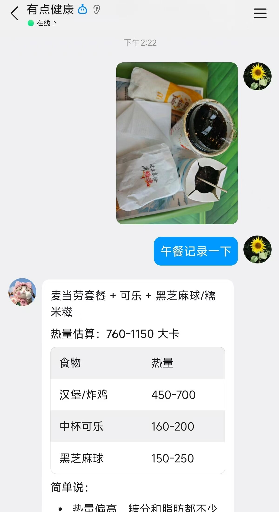
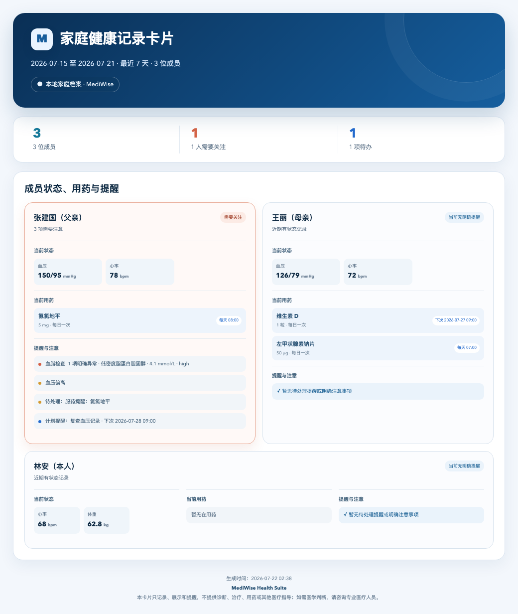
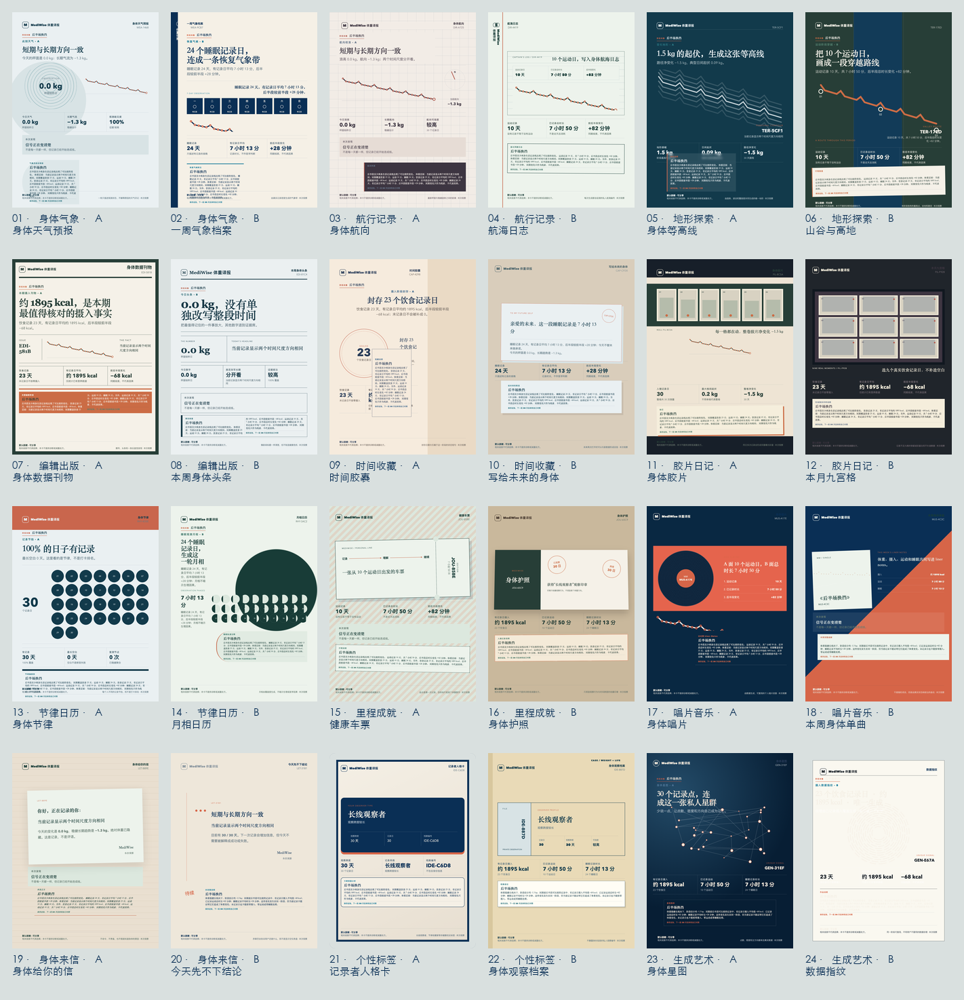

# MediWise Health Suite

中文 | [English](README_EN.md)

<div align="center">

**面向支持 Skills 的 AI Agent 的个人本地健康助手**

拍照、发文件或直接聊天，就能记录饮食运动、整理医疗资料、追踪健康设备数据，并把本人和家人的健康信息留在自己的设备上。

[](https://github.com/JuneYaooo/mediwise-health-suite/releases/tag/v2.0.9)
[](LICENSE)
[](https://www.python.org/downloads/)
[](SKILL.md)
[](https://openclaw.ai)
[](https://github.com/JuneYaooo/mediwise-health-suite/stargazers)

[一张图看懂](#一张图看懂-mediwise) · [常用场景](#三个常用场景) · [健康译报](#健康译报) · [5 分钟上手](#5-分钟上手) · [功能全览](#功能全览) · [隐私与安全](#隐私与安全) · [文档中心](docs/README.md)

</div>

---

MediWise Health Suite（简称 **MediWise**）可以运行在 **Hermes、OpenClaw、Claude Code、Codex、WorkBuddy**，以及其他能够加载 Skills、访问本地文件并执行脚本的 AI Agent 工具中。它适合长期管理本人和家人的健康信息，默认数据保存在本地，换设备时也可以备份和迁移。

不同工具的 Skill 安装位置和聊天入口可能不同。OpenClaw（龙虾）目前另有完整的自动安装、飞书或微信私聊接入与验收说明；使用其他 Agent 时，按该工具自己的 Skills 加载方式安装即可。

> MediWise 只提供健康信息的记录、整理、查询、展示和提醒，不提供诊断、治疗建议、用药建议、营养治疗建议、临床判断或其他医疗指导。

## 一张图看懂 MediWise


你只需要通过聊天、照片、PDF 或设备文件提供信息。MediWise 会按成员整理成本地健康档案，并在需要时帮你查询记录、查看健康记录卡片和管理用药或复查待办；当前 Agent 已配置调度能力时，还可以到点主动通知。

## 三个常用场景

### 1. 拍照记录饮食，聊天记录运动

吃饭前拍一张照片，MediWise 可以识别食物、询问分量，并整理成一餐记录；运动后发一句话或上传运动截图，就能记录项目、时长、距离和消耗。连续使用后，可以查看每日汇总、周趋势和体重目标进度。

你可以直接说：

```text
[上传午餐照片] 帮我识别这顿饭，确认后记录热量和营养。
记录今天运动：快走 45 分钟，3.8 公里。
[上传运动截图] 把这次运动记录到我的档案。
帮我看看最近 7 天的饮食、运动和体重变化。
```

<p align="center">
  
</p>

<p align="center"><sub>拍照识别食物的实际对话示例。图片识别和热量结果用于辅助记录，保存前应确认食物、分量和包装信息。</sub></p>

食物识别可以使用当前 Agent 已有的图片理解能力；热量和营养数值必须来自可核验的数据源。仓库默认不捆绑食物数据库，也不会用模型记忆直接估算后写库。未配置 USDA、Open Food Facts 或已授权的本地数据包时，需要用户提供包装营养标签，或由配置 Agent 在取得同意后启用数据源。

### 2. 上传医疗资料，建立本地档案和用药提醒

把体检报告、化验单、处方或就诊资料拍照上传，MediWise 会提取关键信息，请你确认后写入对应成员的本地档案。之后可以随时查历史记录、管理在用药、设置服药或复查提醒，并在就医前快速整理近期情况。

提醒默认保存为本地待办记录。当前 Agent 支持并已经配置定时任务时，可以进一步实现到点主动通知；MediWise 本身不包含后台守护进程、短信或电话推送。

你可以直接说：

```text
[上传体检报告] 提取关键指标，先让我确认，再记到我的档案。
我从今天开始服用这个药，每天早晚各一次，提醒我按时服药。
下周三提醒我复查血常规。
我准备去看医生，帮我整理近期症状、指标和在用药。
帮我生成最近 7 天的健康记录卡片。
```

<table>
  <tr>
    <td width="50%" align="center"></td>
    <td width="50%" align="center"></td>
  </tr>
  <tr>
    <td align="center">个人健康记录卡片</td>
    <td align="center">家庭健康记录卡片</td>
  </tr>
</table>

个人卡片会整理已有的指标、饮食运动、睡眠、医疗记录和用药。家庭卡片只展示每位成员的当前状态、在用药、服药或复查提醒，以及已记录的注意事项，不展示时间轴。示例使用虚构人物和虚构数据，不提供医疗指导。

### 3. 接入健康设备，查看趋势和健康提醒

把 Apple Health 或 Gadgetbridge 导出的数据交给 MediWise，就能把步数、心率、睡眠、体重等记录汇总到同一份档案中，用自然语言查看趋势，并为需要关注的指标设置提醒。

你可以直接说：

```text
[上传 Apple 健康导出包] 导入我的档案，并告诉我新增了哪些指标。
帮我看最近 30 天的静息心率和睡眠趋势。
如果我的血压超过设定范围，请在健康摘要里提醒我。
帮我生成最近 7 天的健康记录卡片。
```

目前 Apple Health 和 Gadgetbridge 文件导入已经验证可用；Garmin Connect 仍为实验性接入。其他设备的最新状态和导出方法见 [可穿戴数据导入指南](docs/WEARABLES.md)。

## 健康译报

**把已有记录翻译成一段看得懂、愿意保存的近况。**

健康译报是一套八域观察与叙事引擎，覆盖体重、睡眠、生命体征、摄入、活动、服药记录、记录行为和家庭记录。每个域只定义读取哪类记录、怎样折叠同日数据以及如何陈述数字方向；卡片只复述实际记录、空白和同期变化，不给出医学判断，也不把相关性写成原因。

体重译报是这套引擎的展示案例，而不是产品边界。它会先把同日多次测量折叠为中位数，用 Theil–Sen 稳健趋势区分“今天的波动”和“一段时间的方向”，再把同期已有的摄入、活动和睡眠记录放在一起观察。

<p align="center">
  
</p>

<p align="center"><sub>24 套不同构图、不同主导信号、不同分析口吻。集合图使用同一组虚构脱敏数据，便于直接比较差异。</sub></p>

- **八域共用一套叙事结构**：各域读取自己的记录和词表，共用 24 套模板；没有记录的日期保持空白，不补成零。
- **体重是展示案例**：体重观察稳健方向，摄入只统计有记录日，活动只陈述设备或条目记录，睡眠只描述记录时长。
- **24 张不是换皮**：每套都有独立视觉轮廓和信息顺序，同一组事实可以呈现为气象简报、船长日志、编辑导语、唱片内页或档案页。
- **事实可以核对**：先陈述这一段记录呈现的形状，再列出天数、次数和最新日期；记录不足时只说明线索仍在积累。
- **默认可分享**：隐藏姓名、绝对体重、目标体重和精确日期；家庭记录域不出现成员姓名，也不比较成员。
- **三种本地产物**：可生成自包含 HTML、动画 SVG 和 1080×1440 冻结 PNG；SVG 同时提供静止画面偏好支持。

```text
帮我观察最近 30 天的睡眠记录，生成一张默认脱敏的动画译报。
生成一张体重译报展示案例，把同期已有的摄入、活动和睡眠记录放在一起。
为家庭记录生成译报，不显示姓名，也不比较成员。
```

原有体重分析和经典卡片入口继续可用。[查看 24 套模板与选择规则](weight-card-design/style-system.md)。

## 5 分钟上手

### 1. 让 AI 完成安装

把下面这段话发给 Hermes、OpenClaw、Claude Code、Codex、WorkBuddy，或其他具备本机终端与网络权限的 AI 助手：

```text
请帮我安装并配置 MediWise Health Suite：
https://github.com/JuneYaooo/mediwise-health-suite
完成后帮我检查 Skill 是否已正确加载并可以正常使用。
```

普通用户不需要手动运行脚本或修改配置。安装助手会完成环境检查、安装和基础验收。

### 2. 创建第一个档案

安装并让当前 Agent 重新加载 Skills 后，直接说：

```text
帮我创建本人档案，我叫林安。
记录我今天早上血压 124/79，心率 71。
帮我看看最近 7 天的健康情况。
```

也可以添加家人：

```text
帮我添加一位家庭成员：张建国，是我的父亲，65 岁。
```

下面是在 OpenClaw 接入飞书后安装并使用 MediWise 的实际界面。Hermes、Claude Code、Codex、WorkBuddy 等工具的界面可能不同，但对话和记录方式相同。

<table>
  <tr>
    <td width="33%" align="center"></td>
    <td width="33%" align="center"></td>
    <td width="33%" align="center"></td>
  </tr>
  <tr>
    <td align="center">① 对话安装</td>
    <td align="center">② 查看可用能力</td>
    <td align="center">③ 创建成员档案</td>
  </tr>
</table>

### 3. 开始用照片和文件记录

```text
[上传一张脱敏化验单] 请提取内容，先让我确认再记录。
[上传午餐照片] 帮我识别并记录这顿饭。
[上传 Apple 健康导出包] 请把数据导入我的档案。
```

更完整的首次使用步骤见 [快速开始](QUICKSTART.md)。

## 功能全览

| 你想做什么 | MediWise 可以做什么 |
|---|---|
| 管理本人和家人 | 为本人、父母、伴侣或孩子建立独立档案 |
| 记录日常指标 | 记录和查询血压、血糖、心率、体温、血氧、体重等数据 |
| 拍照识别资料 | 从食物照片、体检报告、化验单、处方图片或 PDF 中提取信息，确认后保存 |
| 管理饮食和运动 | 记录餐次、营养、体重、围度、运动和目标进度 |
| 翻译体重波动 | 用每日中位数和稳健趋势区分“一天的浪”与“一段时间的方向” |
| 追踪睡眠 | 汇总睡眠时长、分期和变化趋势 |
| 管理用药和提醒 | 维护在用药并保存服药、测量、复查和健康跟进待办；主动通知取决于当前 Agent 的调度能力 |
| 导入设备数据 | 导入 Apple Health 与 Gadgetbridge 导出文件并合并重复记录 |
| 查看趋势和提醒 | 查看指定时间范围的变化、待办和需要关注的记录 |
| 就医前整理 | 汇总近期症状、指标、既往史和在用药，导出文本、图片或 PDF |
| 生成健康记录卡片 | 生成个人或家庭的近期健康概览图片 |
| 生成健康译报 | 用 24 套模板观察和叙述体重、睡眠、生命体征、摄入、活动、服药记录、记录行为或家庭记录，导出默认脱敏的 HTML、动画 SVG 或冻结 PNG；体重是展示案例，旧体重真相卡继续兼容 |
| 本地备份迁移 | 备份健康档案，并在换设备或换环境时恢复 |

## 一个人管理多位家人

MediWise 是个人健康助手，不是多人共享系统。你可以在自己的实例中分别建立本人和家人的档案；记录时说清姓名，助手会在写入前确认目标成员。

```text
帮张建国记录今天血压 150/95。
帮我查看张建国最近 30 天的血压趋势。
帮我生成最近 7 天的家庭健康记录卡片。
```

## 隐私与安全

- 健康数据默认保存在你自己的设备上，可以本地备份和迁移。
- 健康译报默认隐藏姓名、精确日期和域内敏感值；体重展示案例还默认隐藏绝对体重与目标体重，家庭记录域不读取成员姓名或其他身份信息。旧体重真相卡继续使用原有脱敏规则；开启个人字段后，分享前请再次检查产物内容。
- 体检报告、处方和设备导出可能包含敏感信息，上传前建议脱敏。
- 上传给当前 Agent 的附件会按该 Agent 自身的隐私规则处理；MediWise 不会再重复发送。只有你主动配置额外的云端识别 fallback 或其他在线服务时，相关内容才会额外发送给对应服务商。
- 不要把同一份健康数据用于公开群聊或多人共享机器人，也不要在聊天中发送 API Key、密码或 token。
- 本项目只记录、整理、查询、展示和提醒，不会根据健康数据提供诊断、治疗、用药或其他医疗指导。
- 严重或突发症状请及时联系当地医疗机构，不要依赖本项目处理紧急情况。

运行要求：Python 3.8+、Node.js 18+、SQLite 3.x，以及一个能够加载 Skills、访问本地文件并执行脚本的 Agent；支持 Linux、macOS 和 Windows。生成本地 PNG 健康记录卡片、健康译报冻结 PNG、旧体重真相卡或 PDF 还需要 Chrome/Chromium；健康译报的 HTML、动画 SVG，以及纯文字记录和查询不需要。使用 OpenClaw 时要求 2026.3.0+。

## 致谢

感谢 [LINUX DO（linux.do）社区](https://linux.do/) 对开源项目的讨论、测试反馈和经验分享，也感谢所有参与使用、反馈和贡献的朋友。

## 许可证与免责声明

代码采用 [MIT License](LICENSE)。

本项目只提供健康信息的记录、整理、查询、展示、趋势汇总和提醒，不提供诊断、治疗建议、用药建议、营养治疗建议、临床判断、其他医疗指导或紧急医疗服务。报告异常标记和阈值提醒仅用于信息展示；如需医学判断，请咨询专业医疗人员。

---

<div align="center">

[GitHub](https://github.com/JuneYaooo/mediwise-health-suite) · [v2.0.9](https://github.com/JuneYaooo/mediwise-health-suite/releases/tag/v2.0.9)

</div>
