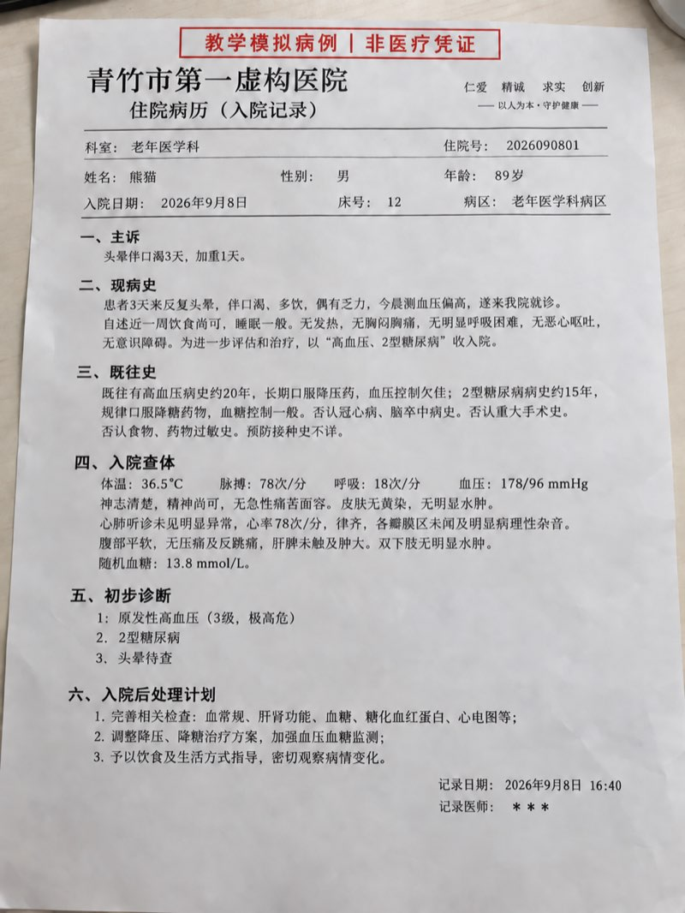
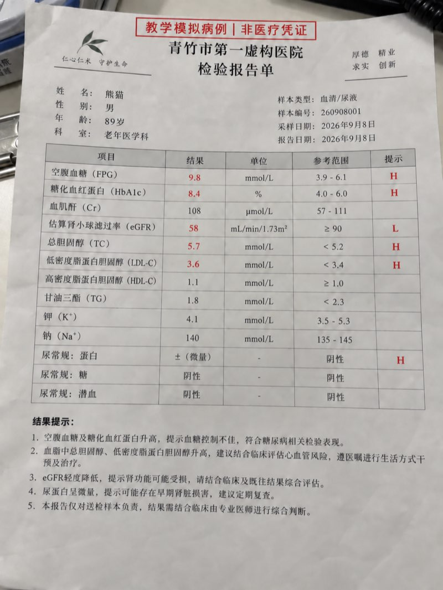
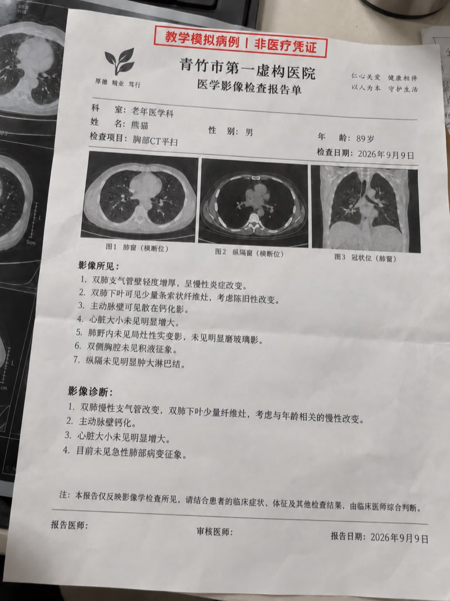
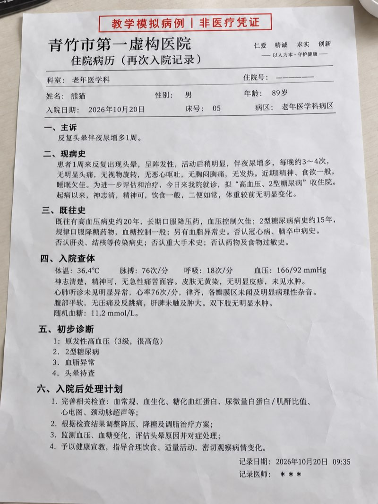
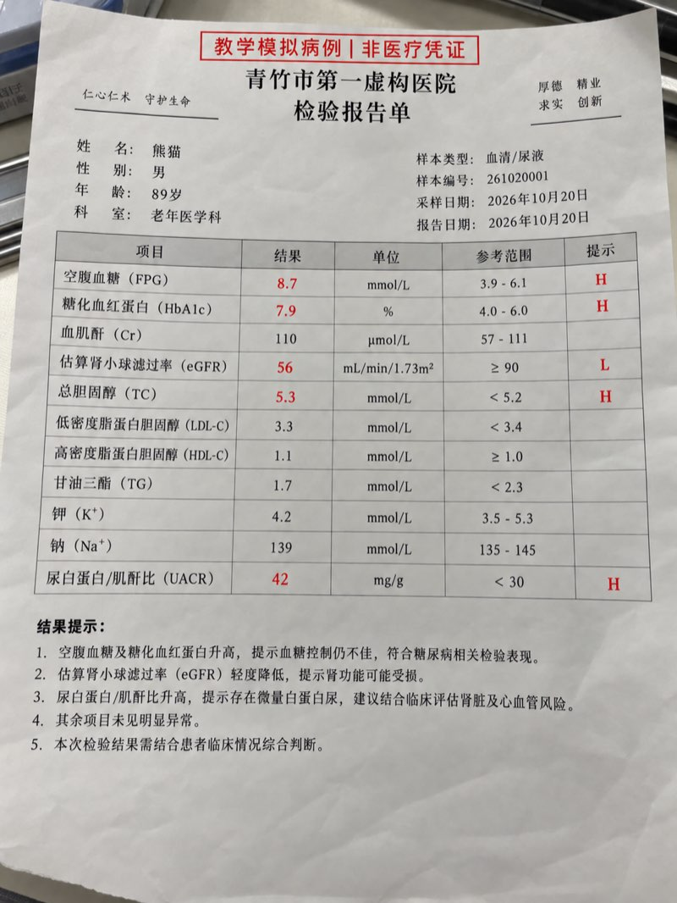
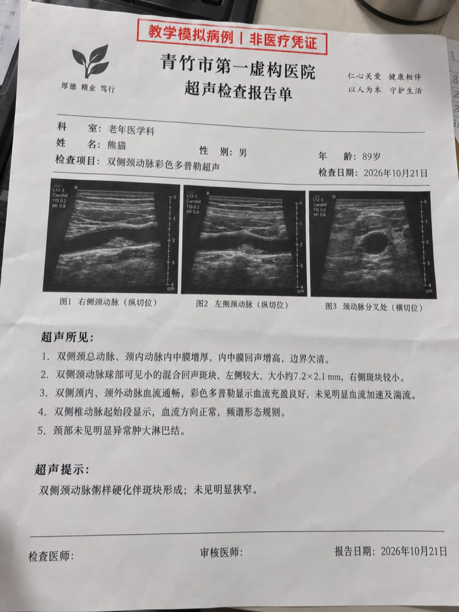
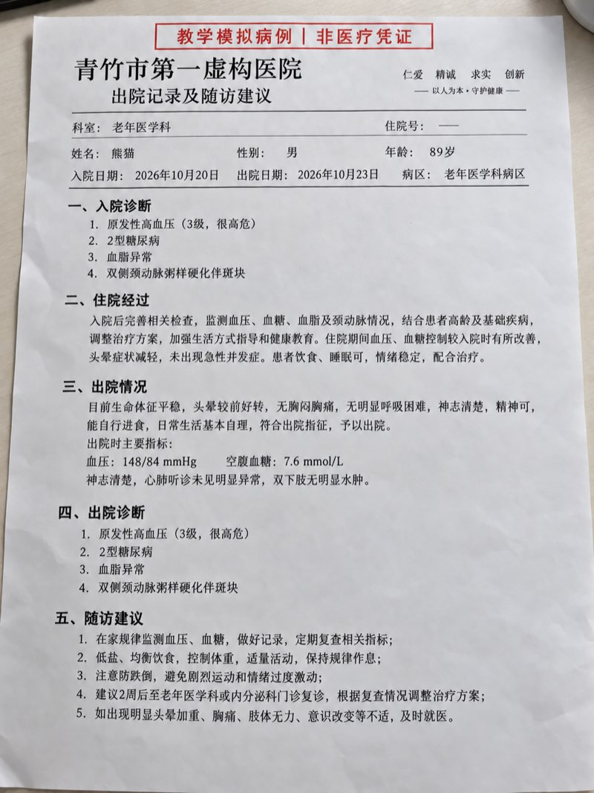
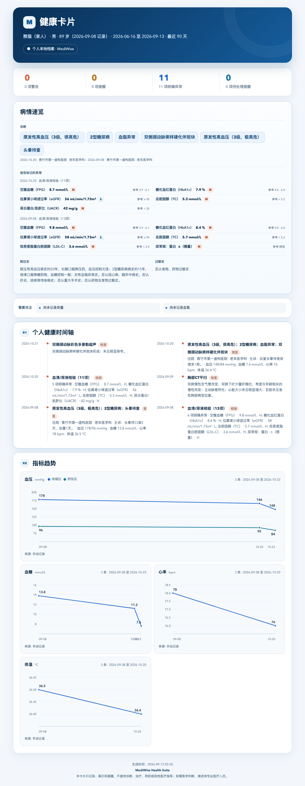

# MediWise Health Suite

中文 | [English](README_EN.md)

<div align="center">

**面向支持 Skills 的 AI Agent 的个人本地健康助手**

拍照、发文件或直接聊天，就能记录饮食运动、整理医疗资料、追踪健康设备数据，并把本人和家人的健康信息留在自己的设备上。

[](https://github.com/JuneYaooo/mediwise-health-suite/releases/tag/v2.0.9)
[](LICENSE)
[](https://www.python.org/downloads/)
[](SKILL.md)
[](https://openclaw.ai)
[](https://github.com/JuneYaooo/mediwise-health-suite/stargazers)

[一张图看懂](#一张图看懂-mediwise) · [常用场景](#三个常用场景) · [健康卡片](#健康卡片) · [5 分钟上手](#5-分钟上手) · [功能全览](#功能全览) · [隐私与安全](#隐私与安全) · [文档中心](docs/README.md)

</div>

---

MediWise Health Suite（简称 **MediWise**）可以运行在 **Hermes、OpenClaw、Claude Code、Codex、WorkBuddy**，以及其他能够加载 Skills、访问本地文件并执行脚本的 AI Agent 工具中。它适合长期管理本人和家人的健康信息，默认数据保存在本地，换设备时也可以备份和迁移。

不同工具的 Skill 安装位置和聊天入口可能不同。OpenClaw（龙虾）目前另有完整的自动安装、飞书或微信私聊接入与验收说明；使用其他 Agent 时，按该工具自己的 Skills 加载方式安装即可。

> MediWise 只提供健康信息的记录、整理、查询、展示和提醒，不提供诊断、治疗建议、用药建议、营养治疗建议、临床判断或其他医疗指导。

## 一张图看懂 MediWise


你只需要通过聊天、照片、PDF 或设备文件提供信息。MediWise 会按成员整理成本地健康档案，并在需要时帮你查询记录、查看健康卡片和管理用药或复查待办；当前 Agent 已配置调度能力时，还可以到点主动通知。

## 三个常用场景

### 1. 拍照记录饮食，聊天记录运动

吃饭前拍一张照片，MediWise 可以识别食物、询问分量，并整理成一餐记录；运动后发一句话或上传运动截图，就能记录项目、时长、距离和消耗。连续使用后，可以查看每日汇总、周趋势和体重目标进度。

你可以直接说：

```text
[上传午餐照片] 帮我识别这顿饭，确认后记录热量和营养。
记录今天运动：快走 45 分钟，3.8 公里。
[上传运动截图] 把这次运动记录到我的档案。
帮我看看最近 7 天的饮食、运动和体重变化。
```

<p align="center">
  
</p>

<p align="center"><sub>拍照识别食物的实际对话示例。图片识别和热量结果用于辅助记录，保存前应确认食物、分量和包装信息。</sub></p>

食物识别可以使用当前 Agent 已有的图片理解能力；热量和营养数值必须来自可核验的数据源。仓库默认不捆绑食物数据库，也不会用模型记忆直接估算后写库。未配置 USDA、Open Food Facts 或已授权的本地数据包时，需要用户提供包装营养标签，或由配置 Agent 在取得同意后启用数据源。

营养值查不到时，**餐次照常记录，但不会写 0**——吃了什么才是记录的核心，丢掉这条等于没记。此时营养字段存为 `NULL`（未知），条目 `note` 标注 `[未解析营养]`，响应返回 `nutrition_status: "unresolved"`，并通过 `action_required` 明确要求 Agent 向用户索取营养标签或说明数据源配置方式。`0` 只表示「确为零」（如水、黑咖啡）。汇总口径同步：未解析的日期作为「未解析」单独报告，不计入任何平均值，因此不会凭空生成一份热量收支。

### 2. 上传医疗资料，建立本地档案和用药提醒

把体检报告、化验单、处方或就诊资料拍照上传，MediWise 会提取关键信息，请你确认后再写入本地档案。**每个成员各一份档案**：本人和其他人都可以分别建档，说清姓名就记到对应的人名下，互不混合。之后可以随时查历史记录、管理在用药、设置服药或复查提醒，并在就医前快速整理近期情况。

提醒默认保存为本地待办记录。当前 Agent 支持并已经配置定时任务时，可以进一步实现到点主动通知；MediWise 本身不包含后台守护进程、短信或电话推送。

你可以直接说：

```text
[上传体检报告] 提取关键指标，先让我确认，再记到我的档案。
我从今天开始服用这个药，每天早晚各一次，提醒我按时服药。
下周三提醒我复查血常规。
我准备去看医生，帮我整理近期症状、指标和在用药。
```

#### 案例走查：本地病例管理

> 教学模拟病例：医院「青竹市第一虚构医院」，患者「熊猫」（男，89 岁），7 张图片每张都盖有「教学模拟病例｜非医疗凭证」章。下面的每个数字都来自这 7 张图，图片就是原图。
>
> 这里示范的是一位患者。多个人按同一套规则分别存储：每个人一份独立档案，互不混合，流程完全一样。

##### 输入：7 张照片

两次住院的单据。点开任意一张看大图。

<table>
  <tr>
    <td width="25%" align="center"><a href="docs/images/case-01-admission-20260908.jpg"></a></td>
    <td width="25%" align="center"><a href="docs/images/case-02-lab-20260908.jpg"></a></td>
    <td width="25%" align="center"><a href="docs/images/case-03-ct-20260909.jpg"></a></td>
    <td width="25%" align="center"><a href="docs/images/case-04-readmission-20261020.jpg"></a></td>
  </tr>
  <tr>
    <td align="center"><sub>① 入院记录 · 2026-09-08<br>诊断 3 项</sub></td>
    <td align="center"><sub>② 检验报告单 · 2026-09-08<br>13 项，6 项带 H/L</sub></td>
    <td align="center"><sub>③ 胸部 CT 平扫 · 2026-09-09<br>影像诊断 4 条</sub></td>
    <td align="center"><sub>④ 再次入院记录 · 2026-10-20<br>诊断 4 项</sub></td>
  </tr>
  <tr>
    <td width="25%" align="center"><a href="docs/images/case-05-lab-20261020.jpg"></a></td>
    <td width="25%" align="center"><a href="docs/images/case-06-carotid-ultrasound-20261021.jpg"></a></td>
    <td width="25%" align="center"><a href="docs/images/case-07-discharge-20261023.jpg"></a></td>
    <td width="25%"></td>
  </tr>
  <tr>
    <td align="center"><sub>⑤ 检验报告单 · 2026-10-20<br>11 项，5 项带 H/L</sub></td>
    <td align="center"><sub>⑥ 双侧颈动脉彩超 · 2026-10-21<br>粥样硬化伴斑块形成</sub></td>
    <td align="center"><sub>⑦ 出院记录 · 2026-10-23<br>出院诊断 4 项、随访建议 5 条</sub></td>
    <td></td>
  </tr>
</table>

##### 怎么做：一句话交给 AI

**你说：**

```text
帮我建一份档案：熊猫，男，89 岁。把这 7 张资料记进去，记之前先让我看一遍。
```

**AI 先把读到的东西列清楚再问你要不要写**：两次住院的时间、诊断、两次入院查体的血压血糖心率体温、两份化验单各有几项带 H/L、两份影像的结论，以及出院记录里的随访建议。你回一句「确认，写进去吧」才落库。

原件上没有的，它不补：资料里没有药名和剂量，就不编用药记录；「呼吸 18 次/分」不在卡片支持的指标类型里，就留在查体原文，不塞进指标表；两次住院对同一条诊断的写法不同（极高危 / 很高危），各自按原文保存。

##### 结果一：档案里有什么

| 记录 | 内容 |
|---|---|
| 就诊记录 | 2 次住院；第 7 页的出院记录回写到第二次住院，出院诊断 4 项成为这次就诊的诊断 |
| 症状 | 6 条（头晕、口渴、多饮、乏力、夜尿增多，头晕两次住院各一条） |
| 检验报告 | 2 份共 24 项，其中 11 项带原件印出的 H/L |
| 影像报告 | 2 份：胸部 CT、颈动脉彩超 |
| 指标读数 | 10 条：两次入院查体各 4 条 + 出院记录的血压和空腹血糖 |
| 原始照片 | 7 张，逐张挂到对应记录上，从记录能点回原图 |
| 用药 | 0 条（资料里没有药名和剂量，不编） |
| 提醒 | 1 条：2026-11-06 09:00 复诊，来自出院记录的随访建议 |

##### 结果二：一张健康卡片

**你说「帮我生成熊猫最近 90 天的健康卡片」**，得到一张卡片，同时导出一份同内容的 HTML。

<p align="center">
  
</p>

卡片上每一块都来自上面的记录：诊断和异常项来自两次就诊与两份化验单的 H/L，趋势图来自那 10 条指标读数，时间轴是 2 次住院 + 2 份化验 + 2 份影像。图上的异常只有两个来源——原件印出的 H/L，和你自己配置的阈值；不画参考范围带，也不按数值给点上色。

*这张卡片生成于 2026-09-13，而病例的第二次住院在 2026-10：卡片不会因为记录日期比生成当天晚就丢掉它，所以表头日期和图上「2026-09-08 至 2026-10-23」会同时出现。真实使用时记录日期不会晚于当天。*

##### 结果三：接着追问

同样一份档案，直接问就行：

**你：** 熊猫现在有哪些诊断？哪些化验项被报告标了异常？

> **AI：** 最近一次是 2026-10-20 至 10-23 的住院，出院诊断 4 项：原发性高血压（3级，很高危）、2型糖尿病、血脂异常、双侧颈动脉粥样硬化伴斑块；目前没有在用药记录。两份化验单里原件印了 H/L 的共 11 项（6 项 + 5 项），集中在血糖、糖化血红蛋白、肾功能、血脂和尿蛋白。这些标记是化验单上本来就有的，我只照抄。

**你：** 两次住院之间血压和血糖怎么变的？

> **AI：** 各有 3 条记录：血压 178/96（09-08）→ 166/92（10-20）→ 148/84（10-23），血糖 13.8（09-08 随机）→ 11.2（10-20 随机）→ 7.6（10-23 空腹）。血糖最后一条是空腹、前两条是随机，场景不一样。我只列数值、日期和场景，好不好要问医生。

**你：** 下次复诊是什么时候？

> **AI：** 2026-11-06 09:00 有一次复诊提醒：「复诊：老年医学科或内分泌科门诊」，来自出院记录的随访建议原文。

**你：** 熊猫这一年都发生了什么？

> **AI：** 6 个事件：两次住院（各带诊断与入院查体数据）、两份检验、两份影像（胸部 CT 的慢性支气管改变与纤维灶、颈动脉粥样硬化伴斑块）。这是提取出来的关键事件和结果，完整原文（现病史、查体、处理计划、随访建议）也都在档案里，随时能调出来。

**每条回答都只转写档案里已有的字段。** 异常只有两个来源：原件印出的 H/L，和你自己配置的阈值；除此之外不做医学判断。

### 3. 接入健康设备，查看趋势和健康提醒

把 Apple Health 或 Gadgetbridge 导出的数据交给 MediWise，就能把步数、心率、睡眠、体重等记录汇总到同一份档案中，用自然语言查看趋势，并为需要关注的指标设置提醒。

你可以直接说：

```text
[上传 Apple 健康导出包] 导入我的档案，并告诉我新增了哪些指标。
帮我看最近 30 天的静息心率和睡眠趋势。
如果我的血压超过设定范围，请在健康摘要里提醒我。
帮我生成最近 7 天的健康卡片。
```

目前 Apple Health 和 Gadgetbridge 文件导入已经验证可用；Garmin Connect 仍为实验性接入。其他设备的最新状态和导出方法见 [可穿戴数据导入指南](docs/WEARABLES.md)。

## 健康卡片

**把已有记录整理成一段看得懂、愿意保存的近况。**

MediWise 生成两种卡片：

- **个人 / 家庭健康卡片**：从已记录的指标、饮食运动、睡眠、医疗记录和用药整理出近期概览。个人卡片把有两条以上记录的指标画成趋势图，只有一条记录的指标保留一行最新值。家庭卡片只展示每位成员的当前状态、在用药、服药或复查提醒，以及已记录的注意事项，不展示时间轴。
- **体重真相卡**：把同一天的多次测量折叠为中位数，用 Theil–Sen 稳健趋势区分“今天的波动”和“一段时间的方向”，并说明最新一次称重与稳健趋势相差多少。记录不足以支撑趋势时，卡片只说明线索仍在积累，不会给出一条凭空的拟合线。

两种卡片都只复述实际记录、空白和同期变化，不给出医学判断，也不把相关性写成原因：先陈述这一段记录呈现的形状，再列出天数、次数和最新日期。

记录卡片是给你自己看的本地产物，会显示成员姓名和真实日期，分享出去前请自行确认内容。体重真相卡默认脱敏：隐藏姓名、绝对体重、目标体重和精确日期，可以直接分享。记录卡片导出为自包含 HTML 和高度自适应的 PNG，体重真相卡固定 1080×1440，渲染需要本机有 Chrome/Chromium。

```text
帮我生成最近 7 天的健康卡片。
生成一张体重真相卡，看看最近的波动是不是已经改了方向。
生成一张可以分享的体重真相卡，只保留趋势和波动。
```

卡片长什么样、每一块读的是哪些记录，见上面的[案例走查：本地病例管理](#案例走查本地病例管理)。

## 5 分钟上手

### 1. 让 AI 完成安装

把下面这段话发给 Hermes、OpenClaw、Claude Code、Codex、WorkBuddy，或其他具备本机终端与网络权限的 AI 助手：

```text
请帮我安装并配置 MediWise Health Suite：
https://github.com/JuneYaooo/mediwise-health-suite
完成后帮我检查 Skill 是否已正确加载并可以正常使用。
```

普通用户不需要手动运行脚本或修改配置。安装助手会完成环境检查、安装和基础验收。

### 2. 创建第一个档案

安装并让当前 Agent 重新加载 Skills 后，直接说：

```text
帮我创建本人档案，我叫林安。
记录我今天早上血压 124/79，心率 71。
帮我看看最近 7 天的健康情况。
```

也可以添加家人：

```text
帮我添加一位家庭成员：张建国，是我的父亲，65 岁。
```

下面是在 OpenClaw 接入飞书后安装并使用 MediWise 的实际界面。Hermes、Claude Code、Codex、WorkBuddy 等工具的界面可能不同，但对话和记录方式相同。

<table>
  <tr>
    <td width="33%" align="center"></td>
    <td width="33%" align="center"></td>
    <td width="33%" align="center"></td>
  </tr>
  <tr>
    <td align="center">① 对话安装</td>
    <td align="center">② 查看可用能力</td>
    <td align="center">③ 创建成员档案</td>
  </tr>
</table>

### 3. 开始用照片和文件记录

```text
[上传一张脱敏化验单] 请提取内容，先让我确认再记录。
[上传午餐照片] 帮我识别并记录这顿饭。
[上传 Apple 健康导出包] 请把数据导入我的档案。
```

更完整的首次使用步骤见 [快速开始](QUICKSTART.md)。

## 功能全览

| 你想做什么 | MediWise 可以做什么 |
|---|---|
| 管理本人和家人 | 为本人、父母、伴侣或孩子建立独立档案 |
| 记录日常指标 | 记录和查询血压、血糖、心率、体温、血氧、体重等数据 |
| 拍照识别资料 | 从食物照片、体检报告、化验单、处方图片或 PDF 中提取信息，确认后保存 |
| 管理饮食和运动 | 记录餐次、营养、体重、围度、运动和目标进度 |
| 翻译体重波动 | 用每日中位数和稳健趋势区分“一天的波动”与“一段时间的方向” |
| 追踪睡眠 | 汇总睡眠时长、分期和变化趋势 |
| 管理用药和提醒 | 维护在用药并保存服药、测量、复查和健康跟进待办；主动通知取决于当前 Agent 的调度能力 |
| 导入设备数据 | 导入 Apple Health 与 Gadgetbridge 导出文件并合并重复记录 |
| 查看趋势和提醒 | 查看指定时间范围的变化、待办和需要关注的记录 |
| 就医前整理 | 汇总近期症状、指标、既往史和在用药，导出文本、图片或 PDF |
| 生成健康卡片 | 生成个人或家庭的近期健康概览，以及区分波动与方向的体重真相卡，导出 HTML 或 PNG |
| 本地备份迁移 | 备份健康档案，并在换设备或换环境时恢复 |

## 一个人管理多位家人

MediWise 是个人健康助手，不是多人共享系统。你可以在自己的实例中分别建立本人和家人的档案；记录时说清姓名，助手会在写入前确认目标成员。

```text
帮张建国记录今天血压 150/95。
帮我查看张建国最近 30 天的血压趋势。
帮我生成最近 7 天的家庭健康卡片。
```

## 隐私与安全

- 健康数据默认保存在你自己的设备上，可以本地备份和迁移。
- 健康卡片保存在本地；记录卡片会显示成员姓名和真实日期，体重真相卡默认隐藏姓名、绝对体重、目标体重和精确日期。分享任何产物前请先打开确认内容。
- 体检报告、处方和设备导出可能包含敏感信息，上传前建议脱敏。
- 上传给当前 Agent 的附件会按该 Agent 自身的隐私规则处理；MediWise 不会再重复发送。只有你主动配置额外的云端识别 fallback 或其他在线服务时，相关内容才会额外发送给对应服务商。
- 不要把同一份健康数据用于公开群聊或多人共享机器人，也不要在聊天中发送 API Key、密码或 token。
- 本项目只记录、整理、查询、展示和提醒，不会根据健康数据提供诊断、治疗、用药或其他医疗指导。
- 严重或突发症状请及时联系当地医疗机构，不要依赖本项目处理紧急情况。

## 致谢

感谢 [LINUX DO（linux.do）社区](https://linux.do/) 对开源项目的讨论、测试反馈和经验分享，也感谢所有参与使用、反馈和贡献的朋友。

## 许可证与免责声明

代码采用 [MIT License](LICENSE)。

本项目只提供健康信息的记录、整理、查询、展示、趋势汇总和提醒，不提供诊断、治疗建议、用药建议、营养治疗建议、临床判断、其他医疗指导或紧急医疗服务。报告异常标记和阈值提醒仅用于信息展示；如需医学判断，请咨询专业医疗人员。
