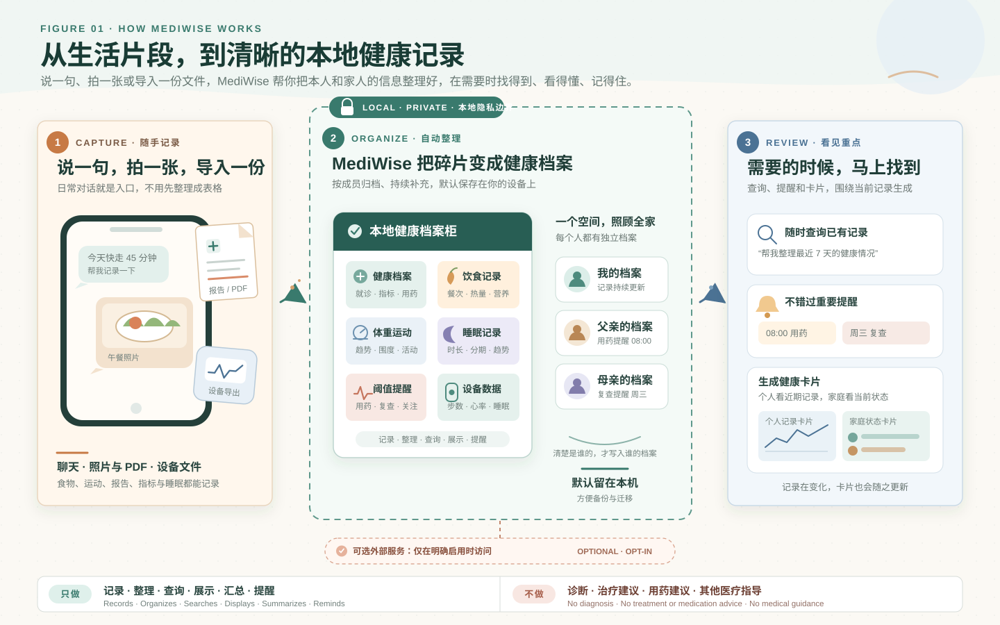
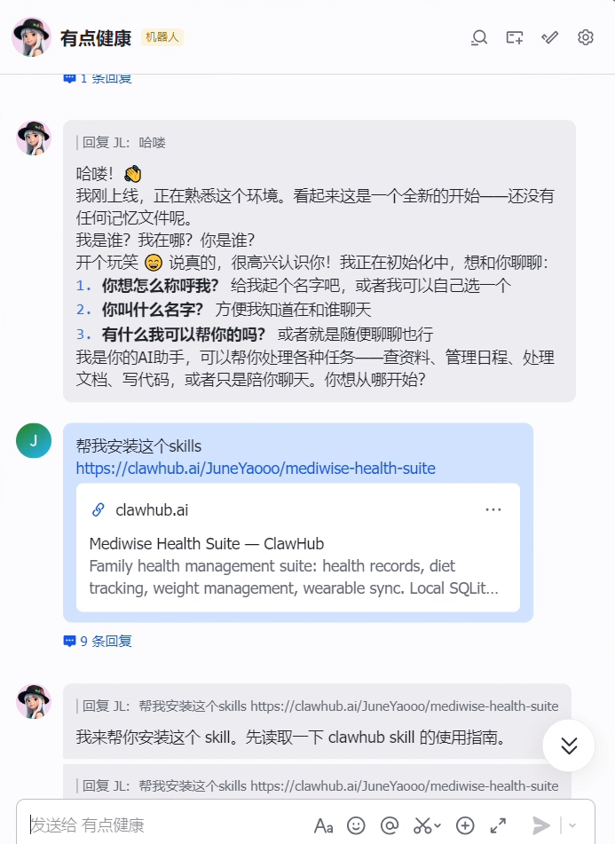
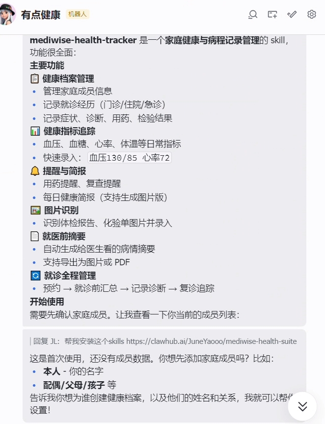
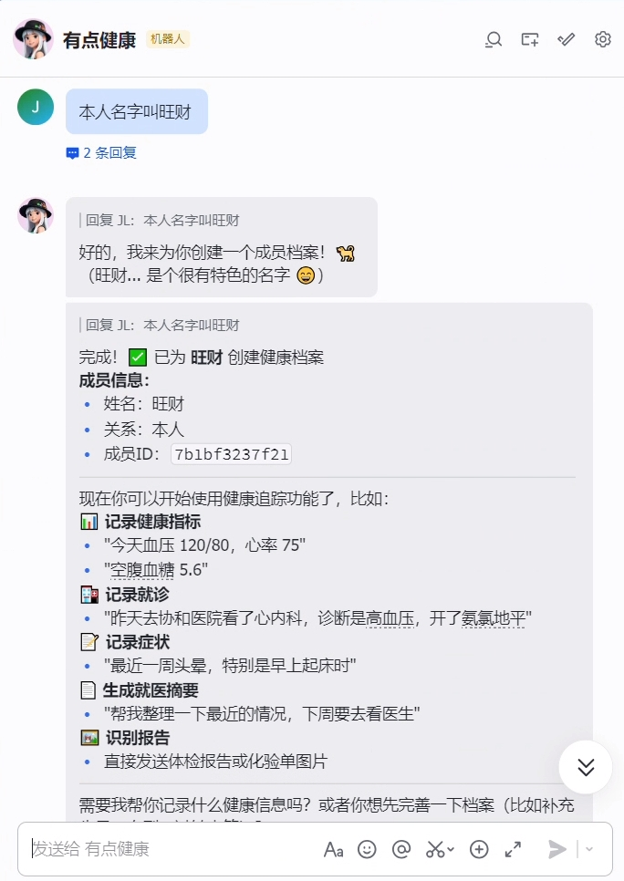
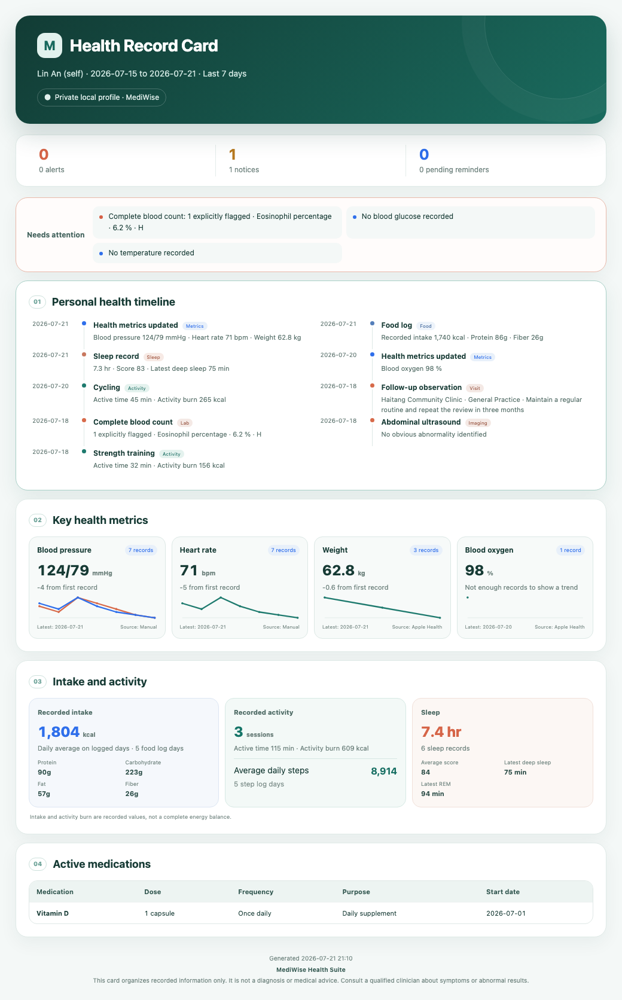

# MediWise Health Suite

[中文](README.md) | English

<div align="center">

**A private, local health assistant for Skills-compatible AI agents**

Keep personal and family health records in one place, including chat notes, medical reports, meals, body measurements, sleep, and wearable exports.

[](https://github.com/JuneYaooo/mediwise-health-suite/releases/tag/v2.0.9)
[](LICENSE)
[](https://www.python.org/downloads/)
[](SKILL.md)
[](https://openclaw.ai)
[](https://github.com/JuneYaooo/mediwise-health-suite/stargazers)

[How it works](#how-mediwise-works) · [Quick setup](#quick-setup) · [Features](#features) · [Screenshots](#screenshots) · [Privacy](#privacy-and-network-access) · [Documentation center](docs/README.md)

</div>

---

The product and complete capability set are named **MediWise Health Suite**, shortened to **MediWise** after the first mention. Names such as `mediwise-health-tracker` and `diet-tracker` are internal Skill module IDs, not separate product names. The generated image summary is consistently called a **Health Record Card**, or a **Family Health Record Card** for the family overview.

MediWise works with **Hermes, OpenClaw, Claude Code, Codex, WorkBuddy**, and other AI agent tools that can load Skills, access local files, and run scripts. Skill locations and chat interfaces vary by tool. OpenClaw currently has the most complete project-specific instructions for automated installation, Feishu or WeChat access, and verification; other agents use their own Skills loading mechanism.

## What it does

Health records tend to be scattered across messages, exported files, report images, and device apps. MediWise turns those fragments into a searchable local record.

```text
Create profiles → Record by chat or image → Track changes → Review alerts → Prepare for a visit → Back up locally
```

You can record blood pressure, blood glucose, medication, meals, weight, sleep, and exercise in natural language. MediWise can also import Apple Health and Gadgetbridge exports. Medical data and lifestyle data are stored in separate local SQLite databases.

MediWise only records, organizes, searches, displays, summarizes, and reminds you about health information. It does not provide diagnoses, treatment advice, medication advice, nutrition therapy, clinical judgment, or any other medical guidance.

## How MediWise works



Share information through chat, photos, PDFs, or wearable exports. MediWise organizes it into local records for each family member, then makes those records available through search, reminders, personal record cards, and family status cards.

## Screenshots

<table>
  <tr>
    <td width="33%" align="center"></td>
    <td width="33%" align="center"></td>
    <td width="33%" align="center"></td>
  </tr>
  <tr>
    <td align="center">1. Ask the assistant to install the suite</td>
    <td align="center">2. Review the available features</td>
    <td align="center">3. Create a health profile</td>
  </tr>
</table>

These screenshots show MediWise Health Suite running in OpenClaw through Feishu. They use the current Chinese interface. Hermes, Claude Code, Codex, WorkBuddy, and other agent tools may look different, but the conversation and record-keeping flow is the same.

### Health record card

Ask MediWise to create a health record card for a recent period:

```text
Create my health record card for the last 7 days.
```

The personal card keeps metric trends, recorded food intake, activity burn, steps, and sleep in a compact overview. A dated personal health timeline then combines metric updates, recent food and activity logs, sleep, visits, lab results, and imaging. It is generated in English when the conversation or requested locale is English.

<p align="center">
  
</p>

The card highlights recent records and reminders. Food averages use logged days only, activity burn shows recorded activity rather than a calorie deficit, and lab flags are shown only when the original report explicitly marks them.

MediWise also has a compact family card for one local user who manages several family profiles. It shows each person's current status, active medications and medication schedules, due or upcoming reminders, and explicit attention items. It does not include a family timeline. Members with alerts, flagged results, or due reminders appear first. Ask for it explicitly:

```text
Create a family health record card for the last 7 days.
```

The example uses a fictional member and fictional health data. It was produced by the same local card generation path used by the skill. Its trend charts are inline SVG and do not require a chart service or CDN.

If the local record contains only one self profile, MediWise can select it by default. Once you add another family member, include the person's name:

```text
Create Zhang Jianguo's health record card for the last 30 days.
```

Missing measurements are shown as missing. MediWise does not invent values to fill the card.

## Features

| Area | What is available | Status |
|---|---|---|
| Health records | Member profiles, visits, symptoms, diagnoses, medication, lab results, and imaging notes | Implemented |
| Health metrics | Blood pressure, blood glucose, heart rate, temperature, weight, blood oxygen, and trends | Implemented |
| Image and PDF intake | Direct attachment reading by the current Agent, with optional local OCR or vision fallback | Implemented |
| Medication and reminders | Active medication, medication logs, and local reminder records; proactive delivery requires a configured Agent scheduler | Implemented locally |
| Diet | Meal records, traceable nutrition sources, daily totals, and nutrition goals | Implemented |
| Weight and exercise | Weight trends, BMI, BMR, TDEE, body measurements, activity, and goals | Implemented |
| Sleep | Duration, deep sleep, light sleep, REM, awake periods, daily summaries, and weekly trends | Implemented |
| Wearable imports | Apple Health and Gadgetbridge file imports with normalization and deduplication | Verified |
| Monitoring | On-demand custom thresholds, anomaly checks, alerts, dashboards, and trend review | Implemented on demand |
| Visit preparation | Recent symptoms, measurements, medication, and history exported as text, image, or PDF | Implemented |

### Wearable support

A provider file in the repository does not necessarily mean that the provider is ready for users. The table below reflects the current implementation and test coverage.

| Source | Current status | What the user provides |
|---|---|---|
| Apple Watch and iPhone | Verified | `export.zip` or `export.xml` exported from the iPhone Health app |
| Gadgetbridge | Verified | A Gadgetbridge SQLite database from a supported, paired device |
| Garmin Connect | Experimental | Uses an unofficial interface and still needs a safe account authorization flow |
| Huawei Health Kit | Unavailable | The OAuth callback flow is incomplete |
| Zepp and Xiaomi cloud accounts | Unavailable | Account compatibility and credential handling are not ready for release |
| OpenWearables | Unavailable | The provider is still a stub |

Apple Health and Gadgetbridge have been checked through the complete local path: add the source, validate the file, import records, normalize them, write them to the database, and skip duplicates on a repeated import. The measurements available to MediWise still depend on the device, app version, export format, and contents of the file.

The user does not run import scripts. Upload the export and ask the assistant:

```text
Import this Apple Health export into my MediWise profile. Check the file before importing it. When you finish, tell me which metrics were imported, how many records were added, what date range they cover, and how many duplicates were skipped.
```

See [the wearable import guide](docs/WEARABLES.md) for the exact file and privacy rules.

## Things you can say

```text
Create a profile for my father, Zhang Jianguo, age 65.
Record Zhang Jianguo's blood pressure as 150/95 and heart rate as 78 today.
Extract the important measurements from this medical report, then ask me to confirm them before saving.
Record lunch: 150 g of rice, 120 g of chicken breast, and 200 g of vegetables.
Record my weight as 65 kg and show the last 30 days.
Import this Apple Health export and tell me how many records were added or skipped.
I have a doctor's appointment next week. Summarize my recent symptoms, measurements, and active medication.
Remind me to measure my blood pressure every evening at 9.
Create my health record card for the last 7 days.
```

For a first trial, create a self profile, record one or two measurements for several days, view the trend, generate a health record card, and create a local backup. Image recognition and wearable imports can be added later.

## Quick setup

### Ask an AI assistant to install it

This is the only setup method recommended for regular users. Send the repository address to Hermes, OpenClaw, Claude Code, Codex, WorkBuddy, or another assistant that can use the terminal and network on your computer:

```text
Please install and configure MediWise Health Suite from this repository:
https://github.com/JuneYaooo/mediwise-health-suite
When you finish, verify that the Skill loads and its basic features work.
```

The repository already contains the detailed instructions an installation assistant needs. It chooses the correct directory, installs dependencies, enables personal local mode, and runs the basic checks. You do not need to repeat implementation details, copy terminal commands, or edit configuration files.

MediWise currently supports one local user who may maintain records for themselves and several family members. It is not intended to serve several people from the same data directory.

### Start a conversation

```text
Create a profile for my father, Zhang Jianguo.
Record Zhang Jianguo's blood pressure as 130/85 and heart rate as 72 today.
Show Zhang Jianguo's health records from the last 7 days.
```

### Image and PDF recognition

If the current Agent can read image or PDF attachments, upload the file and ask MediWise to extract it. No separate MediWise vision configuration is required. MediWise shows the extracted information for confirmation before saving it.

If the current Agent cannot read the attachment, ask a configuration assistant to add a fallback:

```text
The current Agent cannot read this attachment. Configure a local OCR or optional vision fallback for MediWise and test it with a redacted file.
```

Local OCR can be used as a fallback for ordinary images and scanned PDFs. A separately configured vision service is optional and is mainly useful when the current Agent cannot handle complex layouts, tables, or charts.

A cloud vision provider receives the full image or PDF page. Medical documents often contain names, government identifiers, and record numbers. Remove identifying information first or use a local model.

When a fallback is configured, the configuration assistant should test it with redacted image and PDF samples. It must not enable a new cloud service without the user's explicit consent.

See [the installation guide](docs/INSTALLATION.md) for setup checks and troubleshooting.

## Nutrition data sources

MediWise does not write nutrition values from model memory. It looks up a traceable source first:

1. A local CFCD or branded food data package installed by a configuration assistant with the user's approval.
2. USDA FoodData Central when `USDA_API_KEY` has been configured.
3. Open Food Facts when `OPENFOODFACTS_ENABLED=1` has been explicitly enabled, mainly for packaged and barcode products.
4. The nutrition label confirmed by the user when no database result is available.

The repository does not bundle a food database. Without one of the configured sources above, photo-based food recognition can identify candidate foods but cannot save nutrition values until the user supplies a label or approves a source.

To keep food lookup fully offline, say:

```text
Disable all online food lookup in MediWise and confirm that it will use only local nutrition sources.
```

Online food APIs receive the search phrase and the language or pagination fields needed for that request. They do not receive a member ID, meal record, or health record. Check important diet decisions against the product label or a qualified professional.

## Managing records for family members

One person can maintain separate profiles for themselves, parents, a partner, or children in the same local MediWise installation.

```text
Add Zhang Jianguo as my father.
Record Zhang Jianguo's blood pressure as 150/95 today.
Show Zhang Jianguo's blood pressure trend for the last 30 days.
```

Member selection follows these rules:

- If the database contains only one self profile, a request without a name can use that profile.
- After a second member is added, every write must name the person. The assistant must ask if the name is missing.
- Lists and confirmations show both the name and relationship, such as `Zhang Jianguo (father)`.
- Relationship words such as "father" or "mother" work only when that relationship identifies one profile.
- Members with the same name require both a name and relationship for disambiguation.

Family members are records managed by the current local user. They are not separate accounts. Do not attach the same MediWise data directory to a group chat or shared service.

## Privacy and network access

### Default behavior

- Health data is stored in local SQLite databases named `medical.db` and `lifestyle.db`.
- The data directory defaults to permission mode `0700`. Databases, configuration, attachments, and backups default to `0600`.
- API keys, passwords, and tokens should not pass through chat.
- Node action logs omit complete parameters, health content, and OAuth credentials.
- Git ignore rules exclude databases, attachments, configuration, exports, and backups.

### Optional external services

| Feature enabled by the user | Destination | Data sent |
|---|---|---|
| Cloud vision | The configured vision endpoint | Full image or PDF page and the extraction prompt, which may contain personal information |
| USDA lookup | `api.nal.usda.gov` | Food search phrase and API key |
| Open Food Facts lookup | `search.openfoodfacts.org` | Food search phrase, language, and pagination fields |
| Remote embeddings | The configured embedding endpoint | Text fragments used for search |
| Backend API mode | The configured backend | Complete health records, so this should point only to a trusted or self-hosted service |

Normal local record keeping does not contact these services when they are disabled.

The current Agent reads attachments directly when it can; separate MediWise vision configuration is not required. If direct reading is unavailable, no recognition failure silently sends an image or PDF to a new cloud vision model.

## Data location and backup

Default data directories:

| System | Location |
|---|---|
| macOS | `~/Library/Application Support/mediwise` |
| Linux | `$XDG_DATA_HOME/mediwise` or `~/.local/share/mediwise` |
| Windows | `%LOCALAPPDATA%\mediwise` |

The location can be changed with `MEDIWISE_DATA_DIR`, `MEDIWISE_MEDICAL_DB_PATH`, and `MEDIWISE_LIFESTYLE_DB_PATH`. A configuration assistant should manage these settings for regular users.

Back up or restore through natural language:

```text
Create a complete MediWise backup in my personal backup folder. When it finishes, tell me the file location, integrity check result, and permissions. Do not upload it to another service.

Restore the MediWise backup I selected. Check the archive before starting, remind me to stop active synchronization jobs, and do not overwrite the current data until I confirm.
```

Backups contain complete health records and are not encrypted. Keep them in a private location. MediWise checks a backup before restoring it and keeps the current data until replacement is confirmed.

## Documentation

- [Documentation center and project structure](docs/README.md) routes readers to user, installation, Agent, and contributor documentation.
- [Quick start](QUICKSTART.md) covers the shortest path after installation.
- [Installation guide](docs/INSTALLATION.md) covers configuration, privacy choices, and troubleshooting.
- [Wearable import guide](docs/WEARABLES.md) covers Apple Health and Gadgetbridge files.
- [Changelog](CHANGELOG.md) lists published changes.
- [Contributing guide](CONTRIBUTING.md) explains how to submit changes safely.

## Requirements

- Python 3.8 or newer
- Node.js 18 or newer
- SQLite 3.x
- Chrome or Chromium for local PNG health cards and PDF rendering; text records and queries do not require it
- An agent that can load Skills, access local files, and run scripts
- OpenClaw 2026.3.0 or newer when using OpenClaw
- Linux, macOS, or Windows

## Contributing

Bug reports, data source adapters, and documentation improvements are welcome. Do not include real names, reports, account credentials, databases, or other personal health information in an issue, log, or test fixture. See [CONTRIBUTING.md](CONTRIBUTING.md).

## Acknowledgements

- Thanks to the [LINUX DO (linux.do) community](https://linux.do/) for open source discussions, testing feedback, and shared experience, and to everyone who has used, reviewed, or contributed to MediWise.

## License and medical disclaimer

The code is available under the [MIT License](LICENSE).

MediWise Health Suite only records, organizes, searches, displays, summarizes, and reminds you about health information. It does not provide diagnoses, treatment advice, medication advice, nutrition therapy, clinical judgment, any other medical guidance, or emergency medical services. Report flags and threshold reminders are informational only. Contact a qualified medical professional for medical judgment and local emergency services for urgent symptoms.

---

<div align="center">

[GitHub](https://github.com/JuneYaooo/mediwise-health-suite) · [v2.0.9](https://github.com/JuneYaooo/mediwise-health-suite/releases/tag/v2.0.9)

</div>
